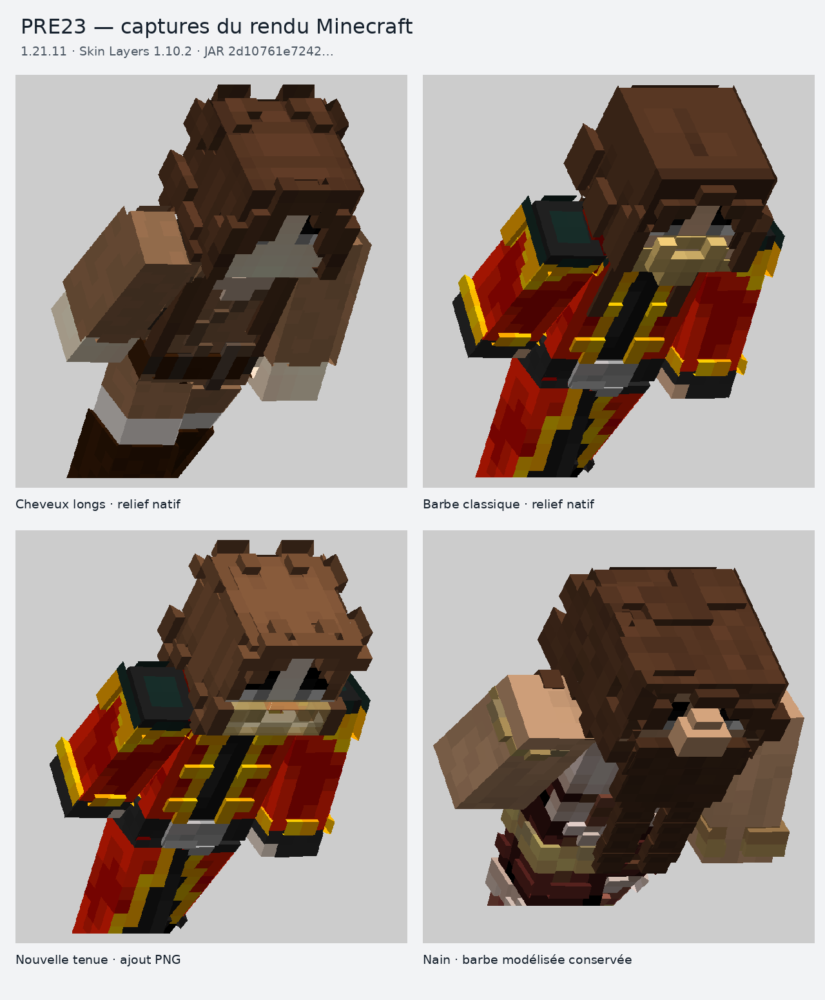

# PRE23 — correctif et vérification du rendu

Le JAR livré est `NexusCharacters-HauteCapitale-1.21.11-BETA-1.0-PRE23.jar`, version interne `1.0.0-beta.23+hc.1.21.11`.

**SHA-256 :** `2d10761e7242b29b6ed1faba2c3dc5456c0b2111e64692018bf72a8cf1d4dbce`

Cette empreinte identifie le fichier soumis aux contrôles ci-dessous. La PRE22 est rejetée ; ses anciens comptes rendus de validation ne constituent plus une preuve de fonctionnement.

## Résultat visible

Cette planche assemble quatre captures du personnage effectivement rendu par Minecraft. Elle comporte uniquement des recadrages et des changements d'échelle. Les 64 captures originales, sans annotation ni recadrage, sont conservées dans [captures.zip](evidence/captures.zip), avec leur [manifeste SHA-256](evidence/captures-manifest.json).

## Corrections

- Les couches de cheveux, vêtements et barbes classiques utilisent la géométrie voxel native de 3D Skin Layers. Les pixels inférieurs qui composent le cosmétique sont pris en charge également. Les détails supérieurs d'origine conservent leur volume ; leur empreinte inférieure reste moins épaisse quand c'est nécessaire pour préserver les mèches, cols et boutons.
- Les surfaces intérieures et les surfaces concurrentes sont découpées avec les rotations, translations et proportions réellement appliquées au personnage. Le traitement intervient après les animations de Player Animation Library. Il concerne le corps, les bras, les jambes et les couches cosmétiques.
- Les manches et les autres couches supérieures héritent de la morphologie de leur partie parente sans appliquer deux fois sa mise à l'échelle. Les triangles des coins natifs et leurs coordonnées UV sont conservés.
- La priorité d'un voxel reste la même quand son empreinte inférieure est amincie. Les fragments de découpage utilisent une frontière commune, ce qui évite de conserver une bande de surfaces concurrentes au raccord.
- Le choix du skin de compte privilégie l'entrée réseau en cache et conserve le dernier skin valide pendant une réponse provisoire de skin par défaut. Une ancienne copie de `skinValue` ne remplace plus cette entrée dans le rendu du joueur.
- La signature d'un appel hérité dans le rendu du nez de nain est corrigée pour Minecraft 1.21.11. Les modèles de nez et de barbes déjà en 3D ne sont pas reconstruits.

Les **4 958 fichiers d'assets sont identiques octet par octet à la PRE17**, sans fichier supprimé ni ajouté dans le JAR de production. Voir [asset-integrity.json](evidence/asset-integrity.json).

## Contrôles du fichier final

| Contrôle | Couverture | Résultat |
|---|---|---|
| Catalogue complet | 57 configurations × 3 poses : chaque tenue, coiffure et barbe classique découverte, y compris les cinq ajouts de test | 171 poses ; 0 surface coplanaire superposée, 0 intersection |
| Joueur Minecraft | 12 configurations × 5 poses : marche, accroupissement, arc, attaque, proportions différentes, animation PAL active et barbe de nain modélisée | 60 poses ; 0 intersection, 0 superposition, 0 couche 3D attendue manquante ; 36 captures |
| Aperçu du menu | 4 configurations ; modèles de widget à bras larges et fins, puis entités d'aperçu dans un monde ; 3 angles de capture | 12 contrôles géométriques ; 0 chevauchement ; 24 captures |
| Première et troisième personne | Rendu du joueur dans le monde | Bras 3D effectivement dessinés ; 2 captures |
| Skin de compte | Texture distincte injectée dans l'entrée réseau en cache ; aperçu, joueur réel, état du renderer, défaut temporaire et ancienne copie sauvegardée | Contrôles réussis ; 2 captures avec la texture attendue |
| Nouveaux assets | Deux coiffures, deux barbes classiques, une tenue ajoutées comme PNG au module de ressources de test | Découverte automatique et rendu 3D réussis sans modifier le catalogue Java |
| Recharge des ressources | Invalidation des caches avant les nouveaux assets | Reconstruction réussie |
| Géométrie et méthode d'audit | 36 soustractions avec rotations et proportions ; aire, UV, triangles natifs, priorité ; vrais chevauchements et petits triangles adjacents connus | Contrôles réussis |
| Contre-test PRE22 | Ancien JAR, client de test séparé, même audit final | Rejet : 8 227 chevauchements/intersections dans les contrôles d'aperçu |

Les 57 configurations du catalogue vérifient chaque entrée séparément, et non toutes les combinaisons possibles entre coiffures, barbes et vêtements. Les 12 configurations du joueur ajoutent des associations et des poses animées. L'audit conserve les transformations effectives ; il ne remet pas les angles à zéro. Il vérifie aussi la planéité des polygones et utilise leur normale soumise au renderer pour éviter d'amplifier les arrondis des triangles très fins. La tolérance de comparaison des plans est de 0,0001 pixel.

## Environnement et portée

Minecraft 1.21.11, Java 21, Fabric Loader 0.19.5, Fabric API 0.141.6, Skin Layers 1.10.2, Capitale RP HUD 1.3.3-beta.1, Player Animation Library 1.1.10, Sodium 0.8.7, ImmediatelyFast 1.14.2 et EntityCulling 1.10.2 sont chargés ensemble. Le client Minecraft est exécuté avec OpenGL logiciel OSMesa/llvmpipe ; les captures proviennent de ce client. L'option de compatibilité Iris de Skin Layers est exercée, sans installation d'Iris ni d'un pack de shaders.

Le contrôle du skin de compte porte sur la résolution et la conservation d'un skin en cache, avec une texture reconnaissable. Le banc utilise un profil hors ligne ; il n'effectue pas une connexion authentifiée au compte Mojang d'Arthur. Une panne du service de téléchargement n'est donc pas présentée comme un contrôle réseau réussi.

Le journal mesure 440 recalculs de surfaces : moyenne de 12,23 ms, maximum de 119,95 ms, comprenant les préparations de nouveaux modèles sur le banc logiciel. Cette mesure n'est pas un résultat de FPS sur une carte graphique de jeu.

## Installation et prochains assets

Remplacer les anciens JAR NexusCharacters par cette PRE23 dans les installations concernées, en ne conservant qu'une seule version de NexusCharacters dans `mods`. Conserver les dépendances utilisées par le mod, notamment Skin Layers. Aucun module de test n'est inclus dans le JAR de production.

Les nouvelles ressources sont découvertes à partir de leur dossier et de leur nom, puis traitées par le même mécanisme de géométrie. Voir [AJOUT_ASSETS.md](AJOUT_ASSETS.md) pour les chemins, noms, identifiants et la recharge des ressources.

## Preuves et reproduction

- [Synthèse liée à l'empreinte du JAR](evidence/validation-run.json)
- [Journal du catalogue](evidence/catalog-final.txt)
- [Journal du joueur et du skin de compte](evidence/actual-final.txt)
- [Journal des aperçus](evidence/preview-final.txt)
- [Contre-test de la PRE22](evidence/pre22-rejected-final-tests.txt)
- [Tests géométriques indépendants](evidence/geometry-final.txt)

Les sources corrigées, les sources des tests et les ressources de test sont conservées dans ce dossier. Le fichier `test-assets.zip` contient leurs PNG ; le module de test les charge séparément du JAR livré. `final_check.py` refuse les démarrages qui n'atteignent pas le marqueur de fin et vérifie la version chargée, les captures et l'empreinte du fichier final.

Les classes ont été compilées localement avec les bibliothèques de Minecraft et des mods du banc. `build-manifest.json` conserve leurs empreintes, celles des sources et des tests. Le workflow GitHub reconstruit le JAR exact à partir de la PRE22 et de ces classes compilées, vérifie l'empreinte de chaque élément puis celle du JAR, et sauvegarde ce fichier sur la branche du correctif. Cette étape d'assemblage n'est pas présentée comme une nouvelle exécution de Minecraft sur GitHub.
